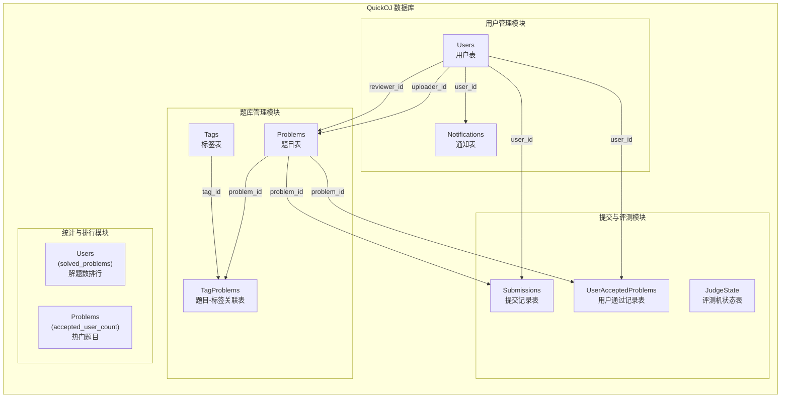
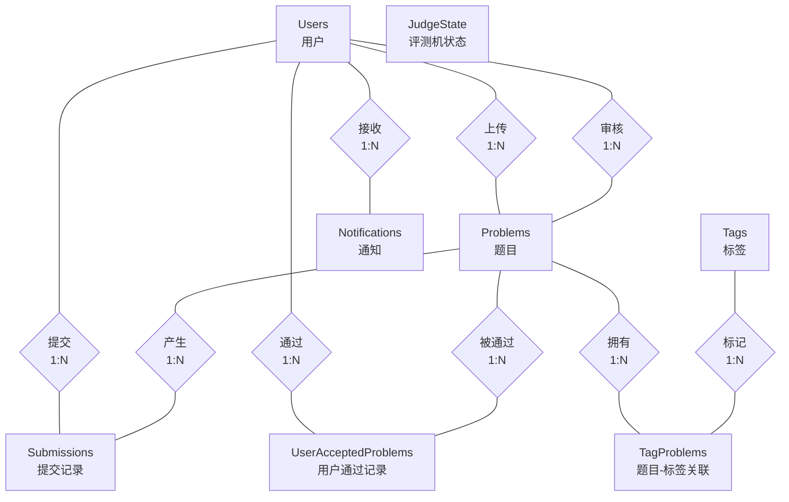
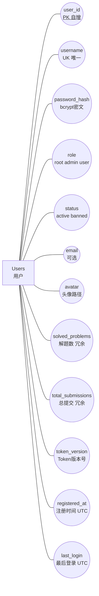
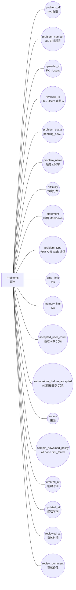
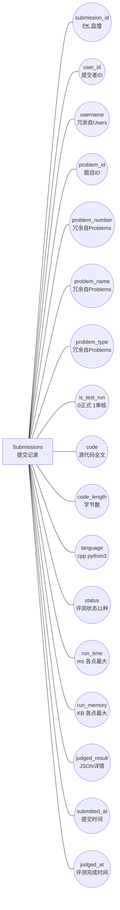
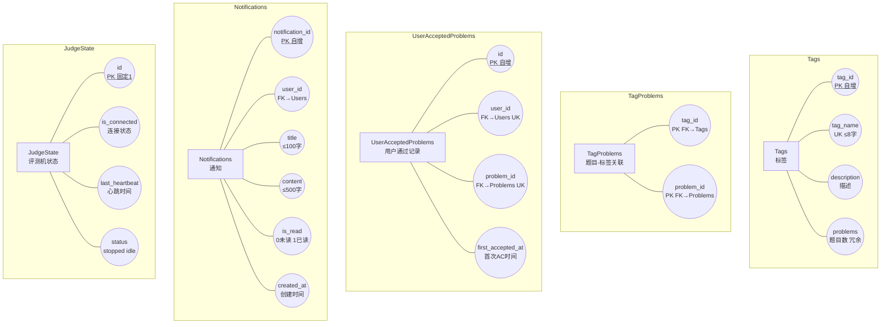

# QuickOJ —— 数据库需求文档

> 本文档为 QuickOJ 数据库的完整设计说明书。配套《项目总需求文档》使用。

---

## 目录

1. [数据库概述](#一数据库概述)
2. [数据库系统功能模块图](#二数据库系统功能模块图)
3. [数据库实例关系 E-R 图](#三数据库实例关系-e-r-图)
4. [数据表设计](#四数据表设计)
5. [数据库视图](#五数据库视图)
6. [索引设计](#六索引设计)
7. [总结与评价](#七总结与评价)
8. [附录：完整建表 DDL](#八附录完整建表-ddl)

---

## 一、数据库概述

### 1.1 基本信息

| 项目 | 内容 |
| :--- | :--- |
| 数据库系统 | Microsoft SQL Server |
| 数据库名 | `OJPlatform` |
| 驱动 | ODBC Driver 17 for SQL Server |
| ORM | SQLAlchemy 2.0 + pyodbc |
| 字符编码 | NVARCHAR 列支持 Unicode（中文、英文标签等） |
| 连接池 | pool_size=10, max_overflow=20, pool_recycle=3600s |

### 1.2 表清单

| 序号 | 表名 | 中文名 | 用途 | 行数特征 |
| :--- | :--- | :--- | :--- | :--- |
| 1 | `Users` | 用户表 | 用户身份、权限、统计数据 | 增长较慢（用户注册） |
| 2 | `Tags` | 标签表 | 题目标签主表 | 增长较慢（管理员/用户创建） |
| 3 | `Problems` | 题目表 | 题目信息、状态、审核记录 | 增长较慢（用户上传） |
| 4 | `TagProblems` | 题目-标签关联表 | 多对多关系 | 随题目和标签增长 |
| 5 | `Submissions` | 提交记录表 | 提交记录与评测结果 | **高频增长**（每次提交一条） |
| 6 | `UserAcceptedProblems` | 用户通过记录表 | 用户 AC 缓存 | 随首次通过增长 |
| 7 | `Notifications` | 通知表 | 系统消息通知 | 持续增长 |
| 8 | `JudgeState` | 评测机状态表 | 评测机连接管理 | **单行记录** |

> **说明**：JudgeState 表由 SQLAlchemy ORM 在应用启动时自动创建，不在 `database/init.sql` 中，但属于逻辑上独立的数据库实体。

---

## 二、数据库系统功能模块图



**模块说明**：

| 功能模块 | 涉及表 | 核心操作 |
| :--- | :--- | :--- |
| 用户管理 | `Users`, `Notifications` | 注册/登录/封禁/角色变更/消息通知 |
| 题库管理 | `Problems`, `Tags`, `TagProblems` | 题目CRUD/标签检索/审核流程 |
| 提交与评测 | `Submissions`, `UserAcceptedProblems`, `JudgeState` | 代码提交/评测调度/结果回写/AC记录 |
| 统计与排行 | `Users`, `Problems` | 排行榜（solved_problems DESC）/ 热门题目 / 个人统计 |

---

## 三、数据库实例关系 E-R 图

> 采用经典的陈氏 E-R 图表示法：**矩形** = 实体，**椭圆形** = 属性，**菱形** = 关系，**直线** = 连接。
> 主键属性名加下划线表示。

### 3.1 全局 E-R 图



### 3.2 实体与属性详图

#### Users 实体及其属性



#### Problems 实体及其属性



#### Submissions 实体及其属性



#### 其余实体及其属性



### 3.3 实体关系说明

| 编号 | 关系名 | 参与实体 | 基数 | 实现方式 |
| :--- | :--- | :--- | :--- | :--- |
| R1 | **上传** | Users → Problems | 1 : N | Problems.uploader_id 外键 |
| R2 | **审核** | Users → Problems | 1 : N | Problems.reviewer_id 外键（可为 NULL） |
| R3 | **提交** | Users → Submissions | 1 : N | Submissions.user_id 列（不设外键约束） |
| R4 | **通过** | Users → UserAcceptedProblems | 1 : N | UNIQUE(user_id, problem_id) 保证不重复 |
| R5 | **接收** | Users → Notifications | 1 : N | Notifications.user_id 外键 |
| R6 | **产生** | Problems → Submissions | 1 : N | Submissions.problem_id 列（不设外键约束） |
| R7 | **被通过** | Problems → UserAcceptedProblems | 1 : N | UserAcceptedProblems.problem_id 外键 |
| R8 | **拥有** | Problems → TagProblems | 1 : N | TagProblems.problem_id 外键 |
| R9 | **标记** | Tags → TagProblems | 1 : N | TagProblems.tag_id 外键 |
| R10 | — | JudgeState（独立实体） | 单行 | 不与任何表关联，Watchdog 更新心跳 |

> **注**：Submissions 表的 `user_id` 和 `problem_id` 不设外键约束，目的是在用户或题目被删除后保留提交历史记录。

---

## 四、数据表设计

### 4.1 Users 表

| 字段名 | 中文含义 | 类型 | 非空 | 默认值 | 约束 | 说明 |
| :--- | :--- | :--- | :--- | :--- | :--- | :--- |
| `user_id` | 用户ID | `BIGINT` | 是 | IDENTITY(1,1) | **主键** | 自增 |
| `username` | 用户名 | `VARCHAR(30)` | 是 | - | **UNIQUE** | 4~20位，字母/数字/下划线，首字不能是数字 |
| `password_hash` | 密码哈希 | `VARCHAR(255)` | 是 | - | - | bcrypt 哈希，不存明文 |
| `role` | 角色 | `VARCHAR(20)` | 是 | `'user'` | **CHECK** IN (`root`,`admin`,`user`) | 权限等级：root(1) > admin(2) > user(3) |
| `status` | 账号状态 | `VARCHAR(20)` | 是 | `'active'` | **CHECK** IN (`active`,`banned`) | 被封禁后无法登录 |
| `email` | 邮箱 | `VARCHAR(100)` | 否 | NULL | - | 可选，需唯一 |
| `avatar` | 头像路径 | `VARCHAR(255)` | 否 | NULL | - | 如 `/avatars/1_a1b2c3d4.jpg`；UUID 命名绕过浏览器缓存 |
| `solved_problems` | 解题数 | `INT` | 是 | `0` | - | 冗余字段，首次 AC 时 +1 |
| `total_submissions` | 总提交 | `INT` | 是 | `0` | - | 冗余字段，正式提评测完后+1（限未AC该题时） |
| `token_version` | Token版本 | `INT` | 是 | `0` | - | 每次登录/改密/被封禁时 +1，旧 Token 立即失效 |
| `registered_at` | 注册时间 | `DATETIME` | 是 | `GETDATE()` | - | UTC 时间 |
| `last_login` | 最后登录 | `DATETIME` | 否 | NULL | - | UTC 时间，注册时为空 |

### 4.2 Tags 表

| 字段名 | 中文含义 | 类型 | 非空 | 默认值 | 约束 | 说明 |
| :--- | :--- | :--- | :--- | :--- | :--- | :--- |
| `tag_id` | 标签ID | `BIGINT` | 是 | IDENTITY(1,1) | **主键** | 自增 |
| `tag_name` | 标签名 | `NVARCHAR(50)` | 是 | - | **UNIQUE** | 中文或英文，≤8 字符 |
| `description` | 描述 | `NVARCHAR(500)` | 否 | NULL | - | 标签说明，可选 |
| `problems` | 题目数 | `BIGINT` | 是 | `0` | - | 冗余字段，增删标签关联时后端同步更新 |

### 4.3 Problems 表

| 字段名 | 中文含义 | 类型 | 非空 | 默认值 | 约束 | 说明 |
| :--- | :--- | :--- | :--- | :--- | :--- | :--- |
| `problem_id` | 题目ID | `BIGINT` | 是 | IDENTITY(1,1) | **主键** | 自增；同时作为数据文件夹名 |
| `problem_number` | 题号 | `BIGINT` | 否 | NULL | **UNIQUE** | 对外展示编号。仅审核通过时分配，起始 1001；未分配时为 NULL |
| `uploader_id` | 上传者ID | `BIGINT` | 是 | - | **外键** `Users.user_id` | - |
| `problem_status` | 状态 | `VARCHAR(20)` | 是 | `'pending_new'` | **CHECK** (见下) | 生命周期：pending_new → approved / rejected / frozen / archived；approved + 修改数据 → pending_modify |
| `problem_name` | 题名 | `NVARCHAR(50)` | 是 | - | - | ≤50 字符 |
| `difficulty` | 难度 | `INT` | 是 | - | - | 难度分数，如 800、1200、2000，无单位 |
| `statement` | 题面 | `NVARCHAR(MAX)` | 是 | - | - | Markdown 格式 |
| `problem_type` | 题型 | `VARCHAR(20)` | 是 | - | **CHECK** (见下) | 创建后**不可修改** |
| `time_limit` | 时间限制 | `INT` | 是 | - | - | 单位：ms |
| `memory_limit` | 内存限制 | `INT` | 是 | - | - | 单位：KB |
| `accepted_user_count` | 通过人数 | `INT` | 是 | `0` | - | 冗余字段，首次 AC 时 +1（去重） |
| `submissions_before_accepted` | AC前提交数 | `INT` | 是 | `0` | - | 冗余字段，正式提交评测完后+1（限未AC该题的用户） |
| `source` | 来源 | `NVARCHAR(100)` | 否 | NULL | - | 如 "LeetCode"、"洛谷" |
| `sample_download_policy` | 下载策略 | `VARCHAR(20)` | 是 | `'none'` | **CHECK** (见下) | 样例数据下载权限控制 |
| `created_at` | 创建时间 | `DATETIME` | 是 | `GETDATE()` | - | UTC 时间 |
| `updated_at` | 修改时间 | `DATETIME` | 否 | NULL | - | 每次进入 pending 状态时更新，用于审核 FIFO 排序 |
| `reviewer_id` | 审核人ID | `BIGINT` | 否 | NULL | **外键** `Users.user_id` | 审核时赋值 |
| `reviewed_at` | 审核时间 | `DATETIME` | 否 | NULL | - | 审核时赋值 |
| `review_comment` | 审核备注 | `NVARCHAR(500)` | 否 | NULL | - | ≤500 字符，拒绝时建议填写理由 |

**CHECK 约束详情**：

| 约束名 | 字段 | 允许值 |
| :--- | :--- | :--- |
| `CK_Problems_status` | `problem_status` | `pending_new`, `pending_modify`, `approved`, `rejected`, `archived`, `frozen` |
| `CK_Problems_type` | `problem_type` | `traditional`, `interactive`, `output-only`, `communication` |
| `CK_Problems_download` | `sample_download_policy` | `all`, `none`, `first_failed` |

**状态流转**：

```text
用户上传 ──→ pending_new ──┬── 审核通过 ──→ approved ──→ (修改测试数据) ──→ pending_modify
                           ├── 审核拒绝 ──→ rejected ──→ (重新提交) ──→ pending_new
                           ├── 冻结     ──→ frozen
                           └── 归档     ──→ archived

pending_modify ──┬── 审核通过 ──→ approved (保留编号)
                 └── 审核拒绝 ──→ approved (回退)
```

### 4.4 TagProblems 表

| 字段名 | 中文含义 | 类型 | 非空 | 约束 | 说明 |
| :--- | :--- | :--- | :--- | :--- | :--- |
| `tag_id` | 标签ID | `BIGINT` | 是 | **复合主键**，**外键** `Tags.tag_id` | - |
| `problem_id` | 题目ID | `BIGINT` | 是 | **复合主键**，**外键** `Problems.problem_id` | - |

> 多对多关联表，一道题目可有多个标签（≤4个），一个标签可属于多道题目。

### 4.5 Submissions 表

| 字段名 | 中文含义 | 类型 | 非空 | 默认值 | 说明 |
| :--- | :--- | :--- | :--- | :--- | :--- |
| `submission_id` | 提交ID | `BIGINT` | 是 | IDENTITY(1,1) **主键** | 自增 |
| `user_id` | 提交者ID | `BIGINT` | 是 | - | 不设外键，以保留用户删除后的记录 |
| `username` | 提交者 | `NVARCHAR(50)` | 否 | NULL | **冗余**自 Users，避免 JOIN |
| `problem_id` | 题目ID | `BIGINT` | 是 | - | 不设外键 |
| `problem_number` | 题号 | `BIGINT` | 否 | NULL | **冗余**自 Problems |
| `problem_name` | 题名 | `NVARCHAR(50)` | 否 | NULL | **冗余**自 Problems |
| `problem_type` | 题型 | `VARCHAR(20)` | 是 | - | **冗余**自 Problems |
| `is_test_run` | 审核标记 | `BIT` | 是 | `0` | `0`=正式提交 / `1`=管理员审核测试（使用待审核数据） |
| `code` | 源代码 | `NVARCHAR(MAX)` | 是 | - | 完整源代码 |
| `code_length` | 代码长度 | `INT` | 是 | - | `len(code.encode('utf-8'))`，单位：字节 |
| `language` | 语言 | `VARCHAR(20)` | 是 | - | 支持：`cpp` / `python3` |
| `status` | 状态 | `VARCHAR(20)` | 是 | `'pending'` | 评测状态（11种，详见下表） |
| `run_time` | 运行时间 | `INT` | 否 | NULL | 单位 ms，取各测试点最大值 |
| `run_memory` | 内存占用 | `INT` | 否 | NULL | 单位 KB，取各测试点最大值 |
| `judged_result` | 详情 | `NVARCHAR(MAX)` | 否 | NULL | JSON：`{summary, tests[], compile?, error?}` |
| `submitted_at` | 提交时间 | `DATETIME` | 是 | `GETDATE()` | UTC 时间 |
| `judged_at` | 评测完成 | `DATETIME` | 否 | NULL | UTC 时间 |

**status 枚举值**：

| 值 | 缩写 | 含义 | 是否终态 |
| :--- | :--- | :--- | :--- |
| `pending` | PD | 等待评测 | 否 |
| `running` | RN | 评测中 | 否 |
| `accepted` | AC | 答案正确 | 是 |
| `presentation_error` | PE | 格式错误（token 一致但空白差异） | 是 |
| `wrong_answer` | WA | 答案错误 | 是 |
| `time_limit_exceeded` | TLE | 超出时间限制 | 是 |
| `memory_limit_exceeded` | MLE | 超出内存限制 | 是 |
| `runtime_error` | RE | 运行时错误 | 是 |
| `compile_error` | CE | 编译错误 | 是 |
| `system_error` | SE | 系统错误（评测机离线等） | 是 |
| `rj` | RJ | 被拒绝（管理员连接时因早于阈值被拒） | 是 |

> **反范式说明**：`username`、`problem_number`、`problem_name`、`problem_type`、`code_length` 五个字段为冗余列。提交记录列表页是高频查询，冗余可避免每次 JOIN Users 和 Problems 表，属于有意的性能优化。

### 4.6 UserAcceptedProblems 表

| 字段名 | 中文含义 | 类型 | 非空 | 默认值 | 约束 | 说明 |
| :--- | :--- | :--- | :--- | :--- | :--- | :--- |
| `id` | 记录ID | `BIGINT` | 是 | IDENTITY(1,1) | **主键** | 自增 |
| `user_id` | 用户ID | `BIGINT` | 是 | - | **外键** `Users.user_id`，**UNIQUE**(user_id, problem_id) | - |
| `problem_id` | 题目ID | `BIGINT` | 是 | - | **外键** `Problems.problem_id`，**UNIQUE**(user_id, problem_id) | - |
| `first_accepted_at` | 首次AC | `DATETIME` | 是 | `GETDATE()` | - | 首次通过时间 |

> 同一用户对同一题目只记录一次（`UNIQUE(user_id, problem_id)`）。用于快速判断用户是否已 AC 某题，以及查询用户的通过题目列表。

### 4.7 Notifications 表

| 字段名 | 中文含义 | 类型 | 非空 | 默认值 | 约束 | 说明 |
| :--- | :--- | :--- | :--- | :--- | :--- | :--- |
| `notification_id` | 消息ID | `BIGINT` | 是 | IDENTITY(1,1) | **主键** | 自增 |
| `user_id` | 接收者 | `BIGINT` | 否 | NULL | **外键** `Users.user_id` | NULL 表示不绑定特定用户 |
| `title` | 标题 | `NVARCHAR(100)` | 是 | - | - | ≤100 字符 |
| `content` | 正文 | `NVARCHAR(500)` | 是 | - | - | ≤500 字符 |
| `is_read` | 已读 | `BIT` | 是 | `0` | - | `0`=未读，`1`=已读 |
| `created_at` | 创建时间 | `DATETIME` | 是 | `GETDATE()` | - | UTC 时间 |

**通知触发场景**：

| 场景 | 接收者 | 标题示例 |
| :--- | :--- | :--- |
| 题目审核通过 | 上传者 | "题目审核通过" |
| 题目审核拒绝 | 上传者 | "题目审核被拒绝" |
| 修改样例被拒绝 | 上传者 | "题目修改被拒绝" |
| 管理员编辑他人题目 | 上传者 | "题目被编辑" |
| 角色变更 | 被修改者 | "角色变更通知" |
| 账号封禁 | 被禁者 | "账号封禁通知" |
| 账号解封 | 被解封者 | "账号解封通知" |
| 管理员/站长发送 | 指定用户 | 自定义 |

### 4.8 JudgeState 表

| 字段名 | 中文含义 | 类型 | 非空 | 默认值 | 约束 | 说明 |
| :--- | :--- | :--- | :--- | :--- | :--- | :--- |
| `id` | 固定ID | `INT` | 是 | `1` | **主键** | 固定为 1，确保单行记录 |
| `is_connected` | 连接状态 | `BIT` | 是 | `0` | - | 管理员是否已连接评测机 |
| `last_heartbeat` | 心跳时间 | `DATETIME` | 否 | NULL | - | Watchdog 每 2s 更新；超 10s 判定离线 |
| `status` | 评测机状态 | `VARCHAR(20)` | 是 | `'stopped'` | - | 实际使用：`stopped` / `idle`；`running`/`waiting` 预留未用 |

> 此表由 SQLAlchemy ORM 在应用启动时通过 `Base.metadata.create_all()` 自动创建，不在 `database/init.sql` 脚本中。

---

## 五、数据库视图

### 5.1 v_review_queue（待审核题目队列）

```sql
CREATE VIEW v_review_queue AS
SELECT problem_id, problem_number, problem_name, problem_status, difficulty,
       problem_type, uploader_id, updated_at, created_at
FROM Problems
WHERE problem_status IN ('pending_new', 'pending_modify');
```

| 用途 | 调用位置 | 说明 |
| :--- | :--- | :--- |
| 管理员题库页"待审"计数 | `problems.py` 列表接口 | `db.query(VReviewQueue).count()` |
| （预留）审核队列独立查询 | - | 可替代 `WHERE problem_status IN (...)` 的两表联合查询 |

### 5.2 v_user_solved（用户已通过题目）

```sql
CREATE VIEW v_user_solved AS
SELECT uap.user_id, uap.problem_id, uap.first_accepted_at,
       p.problem_number, p.problem_name, p.difficulty
FROM UserAcceptedProblems uap
JOIN Problems p ON p.problem_id = uap.problem_id;
```

| 用途 | 调用位置 | 说明 |
| :--- | :--- | :--- |
| 题库列表的 `is_solved` 标记 | `problem_service.py` `list_problems()` | 批量查询 `WHERE user_id=X AND problem_id IN (...)` |
| 用户公开主页的"最近通过" | `user_service.py` `get_user_public()` | `ORDER BY first_accepted_at DESC LIMIT 5` |
| 用户已通过题目列表 | `user_service.py` `get_user_solved_problems()` | 分页查询 |

---

## 六、索引设计

### 6.1 索引清单（共 22 条）

| 表 | 索引名 | 索引列 | 类型 | 用途 |
| :--- | :--- | :--- | :--- | :--- |
| Users | `idx_users_role` | `role` | 普通 | 管理员按角色筛选用户 |
| Users | `idx_users_status` | `status` | 普通 | 按封禁/正常筛选 |
| Users | `idx_users_solved` | `solved_problems DESC` | 普通 | 排行榜排序 |
| Problems | `idx_problems_status` | `problem_status` | 普通 | 按状态筛选（审核队列、公开列表） |
| Problems | `idx_problems_uploader` | `uploader_id` | 普通 | 查某用户上传的题目 |
| Problems | `idx_problems_number` | `problem_number` | 过滤 | 按题号检索（`WHERE problem_number IS NOT NULL`） |
| Problems | `idx_problems_accepted_count` | `accepted_user_count DESC` | 普通 | 按通过人数排序 |
| Problems | `idx_problems_updated` | `updated_at` | 普通 | 审核队列 FIFO 排序 |
| Problems | `idx_problems_created` | `created_at DESC` | 普通 | 按创建时间倒序（最新题目） |
| Problems | `idx_problems_difficulty` | `difficulty` | 普通 | 按难度筛选/排序 |
| TagProblems | `idx_tagproblems_problem` | `problem_id` | 普通 | 查某道题的所有标签 |
| TagProblems | `idx_tagproblems_tag` | `tag_id` | 普通 | 查某个标签下的所有题目 |
| Submissions | `idx_submissions_user` | `user_id` | 普通 | 查某用户的提交记录 |
| Submissions | `idx_submissions_problem` | `problem_id` | 普通 | 查某题目的所有提交 |
| Submissions | `idx_submissions_status` | `status` | 普通 | 按评测状态筛选 |
| Submissions | `idx_submissions_time` | `submitted_at DESC` | 普通 | 按提交时间排序（默认） |
| Submissions | `idx_submissions_pending` | `(status, submitted_at)` | **过滤** | 评测调度器拉取待评测（`WHERE status='pending'`） |
| Submissions | `idx_submissions_test` | `is_test_run` | 普通 | 区分正式提交/审核测试 |
| Submissions | `idx_submissions_pnum` | `problem_number` | 过滤 | 按题号检索（`WHERE problem_number > 0`） |
| Submissions | `idx_submissions_username` | `username` | 普通 | 按提交者用户名检索 |
| UserAcceptedProblems | `idx_uap_user` | `user_id` | 普通 | 查某用户通过的所有题目 |
| UserAcceptedProblems | `idx_uap_problem` | `problem_id` | 普通 | 查某题被哪些用户通过 |
| Notifications | `idx_notif_user` | `user_id` | 普通 | 查某用户的所有消息 |
| Notifications | `idx_notif_time` | `created_at DESC` | 普通 | 按时间倒序排列 |

### 6.2 索引设计原则

1. **高频查询优先**：评测调度器每 2s 扫描 `status='pending'` 的提交，`idx_submissions_pending` 使用过滤索引（仅索引 pending 行），大幅减少扫描范围
2. **排序字段索引**：`solved_problems DESC`、`submitted_at DESC`、`created_at DESC` 等排序字段建索引，避免 filesort
3. **过滤索引**：`problem_number WHERE problem_number IS NOT NULL` 和 `problem_number WHERE problem_number > 0` 仅索引已分配编号的记录，NULL 值不入索引，节省空间
4. **关联查询索引**：外键列（`uploader_id`、`user_id`、`problem_id`）均建索引，加速 JOIN
5. **复合索引**：`(status, submitted_at)` 覆盖"按状态筛选 + 按时间排序"的复合查询模式

---

## 七、总结与评价

### 7.1 数据库设计总结

本数据库为算法竞赛在线评测系统（QuickOJ）设计，共包含 **8 张表**、**2 个视图**、**24 条索引**（含 3 条过滤索引），服务于用户管理、题库管理、代码提交评测、题目审核、消息通知、排行榜六大功能模块。

**核心设计决策**：

| 决策 | 内容 | 理由 |
| :--- | :--- | :--- |
| 关系型数据库 | SQL Server | 事务性要求高（提交评测涉及多表更新），强一致性需求 |
| 反范式冗余 | Submissions 冗余 5 列、Users/Problems 冗余计数字段 | 高频查询（提交列表、排行榜）避免多表 JOIN |
| 单行状态表 | JudgeState | 评测机独立进程，需要跨进程共享连接状态的轻量方案 |
| Submissions 不设外键 | `user_id`、`problem_id` 无 FK 约束 | 用户或题目删除后保留历史记录 |
| 过滤索引 | `WHERE status='pending'`、`WHERE problem_number IS NOT NULL` | 显著减小索引体积，加速高频条件查询 |
| 数据库视图 | `v_review_queue`、`v_user_solved` | 封装常用条件查询，简化业务代码 |
| token_version 机制 | 整型版本号代替维护黑名单 | 无状态 JWT 认证下实现单设备登录和即时封禁 |

### 7.2 规范化评价

| 表名 | 范式等级 | 说明 |
| :--- | :--- | :--- |
| Users | **BCNF** | 所有非主属性完全函数依赖于候选键 `user_id` / `username`；`solved_problems` 和 `total_submissions` 虽为冗余但属于有意的性能优化，不破坏函数依赖 |
| Tags | **BCNF** | `tag_name` → `tag_id`，`tag_id` → 所有属性，无部分依赖或传递依赖 |
| Problems | **BCNF** | 全部非主属性完全函数依赖于 `problem_id` / `problem_number`；`uploader_id` 和 `reviewer_id` 为外键，不产生非主属性对码的传递依赖 |
| TagProblems | **BCNF** | 仅有复合主键，无任何非主属性（全键表，至少满足 BCNF） |
| Submissions | **BCNF** | 所有非主属性完全函数依赖于 `submission_id`；冗余列（username、problem_number 等）虽然可由 `user_id`、`problem_id` 推导出来，但 `user_id` 和 `problem_id` 并非候选键（它们不唯一标识一条提交），因此冗余列依赖于主键 `submission_id` 而非其他非主属性，不违反 BCNF |
| UserAcceptedProblems | **BCNF** | 非主属性 `first_accepted_at` 完全函数依赖于候选键 (`user_id`, `problem_id`)，无部分依赖 |
| Notifications | **BCNF** | 全部非主属性完全函数依赖于 `notification_id`，无传递依赖 |
| JudgeState | **BCNF** | 单行表，平凡满足 |

> **结论**：全部 8 张表均满足 BCNF 范式。系统中不存在非主属性对候选键的部分函数依赖或传递函数依赖。冗余字段（计数类和反范式列）均属于有意的性能优化，其值由应用层负责维护一致性，不影响数据库层面的规范化程度。

### 7.3 优点

1. **高内聚低耦合**：实体划分清晰，每个表对应一个明确的业务概念。Users 与 Problems 之间通过外键和关联表实现多对多关系（标签）和多重一对多关系（上传、审核），边界分明。

2. **评测链路高效**：Submissions 表通过冗余列避免查询提交列表时的 JOIN，评测调度器通过过滤索引 `idx_submissions_pending` 在百万行提交记录中仅扫描极少量 pending 行（通常 < 10 行），`SELECT + UPDATE` 使用行锁（`WITH FOR UPDATE SKIP LOCKED`）保证并发安全。

3. **数据完整性保护**：核心表使用 CHECK 约束限制枚举值（role、status、problem_status、problem_type、sample_download_policy），外键约束保证引用完整性（除 Submissions 表有意不设外键外），UNIQUE 约束防止重复数据。

4. **可扩展性**：problem_type 枚举预留了 interactive 和 communication 题型；problem_status 预留了 frozen 和 archived 状态；JudgeState.status 预留了 running/waiting 状态；索引覆盖了当前全部查询模式并按扩展需求预留了部分索引。

5. **认证安全性**：密码 bcrypt 哈希、token_version 单设备登录、封禁即时生效，均通过数据库字段配合实现，无需额外的 Redis/JWT 黑名单中间件。

6. **视图封装**：两个视图将常用的跨表过滤条件封装为语义化名称（`v_review_queue`、`v_user_solved`），简化业务代码且提升可读性。

### 7.4 不足与改进建议

1. **冗余字段一致性风险**：`Users.solved_problems`、`Problems.accepted_user_count` 等冗余计数在并发场景下可能出现与源数据（UserAcceptedProblems 实际行数）不一致。当前通过数据库事务 + 行级更新来保障，但若发生未预料的异常回滚后手动干预，可能产生偏差。
   - **建议**：增加一个后台定时任务（如每日凌晨），通过 COUNT 源表来校准所有冗余计数字段。

2. **Submissions 表缺少状态变更日志**：当前仅记录了 `submitted_at` 和 `judged_at` 两个时间点，无法追踪提交在 pending→running→终态之间的耗时分布。
   - **建议**：如需精细化监控评测队列性能，可增加 `running_at` 字段记录开始评测的时间点。

3. **Notifications 表缺少已读时间**：当前仅记录 `is_read` 布尔值，无法追踪用户何时阅读了消息。
   - **建议**：增加 `read_at DATETIME NULL` 字段。

4. **Tags.problems 冗余计数无约束**：该字段依赖应用层在增删 TagProblems 时同步更新，若代码中存在遗漏的更新路径则会出现计数不准。
   - **建议**：可用触发器（`AFTER INSERT/DELETE ON TagProblems`）来自动维护，降低应用层负担。

5. **JudgeState 单行表的设计限制**：当前仅支持连接一台评测机。若未来需要多评测机集群以支持更高并发，单行记录无法满足。
   - **建议**：多评测机场景下，可将 JudgeState 扩展为多行表（每台评测机一行），或在评测机端实现负载均衡而数据库端维持单行逻辑视图。

6. **Submissions.judged_result 使用 NVARCHAR(MAX) 存储 JSON**：虽然灵活，但 SQL Server 对 JSON 的查询能力较弱（需 `JSON_VALUE`/`OPENJSON`），无法直接在 JSON 字段上建索引。
   - **建议**：若需要对测试点级别的数据进行统计分析（如 TLE 在哪个测试点最频繁），可将 judged_result 拆分为独立的 `TestPointResults` 子表。

7. **缺少数据库级别的软删除机制**：用户和题目被删除时，Submissions 表中的关联记录保留（这正是不设外键的意图），但 Users 和 Problems 表本身是物理删除（DELETE）。若需要审计追溯，物理删除会导致信息永久丢失。
   - **建议**：对 Users 和 Problems 增加 `deleted_at DATETIME NULL` 软删除字段，用 WHERE deleted_at IS NULL 过滤替代物理 DELETE。

### 7.5 总体评价

本数据库设计**完整、规范、务实**。在满足 BCNF 范式的前提下，通过有节制地引入冗余字段和过滤索引，针对 QuickOJ 的核心场景——高并发提交评测、高频提交列表查询——做出了合理的性能优化。表结构清晰、约束完善、索引覆盖充分，能够支撑日均数万次提交的中等规模平台稳定运行。上述改进建议属于进阶优化方向，不影响当前设计的正确性和可用性。

---

## 八、附录：完整建表 DDL

```sql
-- ============================================================
-- QuickOJ 数据库初始化脚本 (SQL Server)
-- ============================================================

CREATE DATABASE OJPlatform;
GO
USE OJPlatform;
GO

-- ============================================================
-- 1. Users 表 —— 用户身份、权限、统计
-- ============================================================
CREATE TABLE Users (
    user_id          BIGINT IDENTITY(1,1) PRIMARY KEY,   -- 用户唯一ID，自增
    username         VARCHAR(30)    NOT NULL,             -- 登录用户名
    password_hash    VARCHAR(255)   NOT NULL,             -- bcrypt 密码哈希
    role             VARCHAR(20)    NOT NULL DEFAULT 'user'
                        CONSTRAINT CK_Users_role CHECK (role IN ('root','admin','user')),
    status           VARCHAR(20)    NOT NULL DEFAULT 'active'
                        CONSTRAINT CK_Users_status CHECK (status IN ('active','banned')),
    email            VARCHAR(100)   NULL,                 -- 邮箱，可选
    avatar           VARCHAR(255)   NULL,                 -- 头像路径
    solved_problems  INT            NOT NULL DEFAULT 0,   -- 解题数（冗余）
    total_submissions INT           NOT NULL DEFAULT 0,   -- 总提交（冗余）
    token_version    INT            NOT NULL DEFAULT 0,   -- Token版本号
    registered_at    DATETIME       NOT NULL DEFAULT GETDATE(),
    last_login       DATETIME       NULL,
    CONSTRAINT UQ_Users_username UNIQUE (username)
);
GO

-- ============================================================
-- 2. Tags 表 —— 题目标签主表
-- ============================================================
CREATE TABLE Tags (
    tag_id      BIGINT IDENTITY(1,1) PRIMARY KEY,
    tag_name    NVARCHAR(50)  NOT NULL,                   -- 标签名（≤8字符）
    description NVARCHAR(500) NULL,                       -- 描述
    problems    BIGINT        NOT NULL DEFAULT 0,         -- 关联题目数（冗余）
    CONSTRAINT UQ_Tags_tag_name UNIQUE (tag_name)
);
GO

-- ============================================================
-- 3. Problems 表 —— 题目信息、状态、审核记录
-- ============================================================
CREATE TABLE Problems (
    problem_id                   BIGINT IDENTITY(1,1) PRIMARY KEY,
    problem_number               BIGINT        NULL,      -- 题号，审核通过后分配
    uploader_id                  BIGINT        NOT NULL REFERENCES Users(user_id),
    problem_status               VARCHAR(20)   NOT NULL DEFAULT 'pending_new'
                                    CONSTRAINT CK_Problems_status CHECK (problem_status IN
                                        ('pending_new','pending_modify','approved','rejected','archived','frozen')),
    problem_name                 NVARCHAR(50)  NOT NULL,
    difficulty                   INT           NOT NULL,
    statement                    NVARCHAR(MAX) NOT NULL,  -- Markdown
    problem_type                 VARCHAR(20)   NOT NULL   -- 创建后不可修改
                                    CONSTRAINT CK_Problems_type CHECK (problem_type IN
                                        ('traditional','interactive','output-only','communication')),
    time_limit                   INT           NOT NULL,  -- 单位 ms
    memory_limit                 INT           NOT NULL,  -- 单位 KB
    accepted_user_count          INT           NOT NULL DEFAULT 0,  -- 通过用户数（冗余）
    submissions_before_accepted  INT           NOT NULL DEFAULT 0,  -- AC前提交数（冗余）
    source                       NVARCHAR(100) NULL,
    sample_download_policy       VARCHAR(20)   NOT NULL DEFAULT 'none'
                                    CONSTRAINT CK_Problems_download CHECK (sample_download_policy IN
                                        ('all','none','first_failed')),
    created_at                   DATETIME      NOT NULL DEFAULT GETDATE(),
    updated_at                   DATETIME      NULL,
    reviewer_id                  BIGINT        NULL REFERENCES Users(user_id),
    reviewed_at                  DATETIME      NULL,
    review_comment               NVARCHAR(500) NULL,
    CONSTRAINT UQ_Problems_number UNIQUE (problem_number)
);
GO

-- ============================================================
-- 4. TagProblems 表 —— 题目-标签多对多关联
-- ============================================================
CREATE TABLE TagProblems (
    tag_id     BIGINT NOT NULL REFERENCES Tags(tag_id),
    problem_id BIGINT NOT NULL REFERENCES Problems(problem_id),
    PRIMARY KEY (tag_id, problem_id)
);
GO

-- ============================================================
-- 5. Submissions 表 —— 提交记录与评测结果
-- ============================================================
CREATE TABLE Submissions (
    submission_id  BIGINT IDENTITY(1,1) PRIMARY KEY,
    user_id        BIGINT         NOT NULL,
    username       NVARCHAR(50)   NULL,                   -- 冗余自 Users
    problem_id     BIGINT         NOT NULL,
    problem_number BIGINT         NULL,                   -- 冗余自 Problems
    problem_name   NVARCHAR(50)   NULL,                   -- 冗余自 Problems
    problem_type   VARCHAR(20)    NOT NULL,               -- 冗余自 Problems
    is_test_run    BIT            NOT NULL DEFAULT 0,     -- 0=正式 / 1=审核测试
    code           NVARCHAR(MAX)  NOT NULL,
    code_length    INT            NOT NULL,
    language       VARCHAR(20)    NOT NULL,
    status         VARCHAR(20)    NOT NULL DEFAULT 'pending',
    run_time       INT            NULL,                   -- ms
    run_memory     INT            NULL,                   -- KB
    judged_result  NVARCHAR(MAX)  NULL,                   -- JSON
    submitted_at   DATETIME       NOT NULL DEFAULT GETDATE(),
    judged_at      DATETIME       NULL
);
GO

-- ============================================================
-- 6. UserAcceptedProblems 表 —— 用户通过记录
-- ============================================================
CREATE TABLE UserAcceptedProblems (
    id                BIGINT IDENTITY(1,1) PRIMARY KEY,
    user_id           BIGINT   NOT NULL REFERENCES Users(user_id),
    problem_id        BIGINT   NOT NULL REFERENCES Problems(problem_id),
    first_accepted_at DATETIME NOT NULL DEFAULT GETDATE(),
    CONSTRAINT UQ_UserAccepted UNIQUE (user_id, problem_id)
);
GO

-- ============================================================
-- 7. Notifications 表 —— 系统消息通知
-- ============================================================
CREATE TABLE Notifications (
    notification_id BIGINT IDENTITY(1,1) PRIMARY KEY,
    user_id         BIGINT        NULL REFERENCES Users(user_id),
    title           NVARCHAR(100) NOT NULL,
    content         NVARCHAR(500) NOT NULL,
    is_read         BIT           NOT NULL DEFAULT 0,
    created_at      DATETIME      NOT NULL DEFAULT GETDATE()
);
GO

-- ============================================================
-- 索引
-- ============================================================

-- Users
CREATE INDEX idx_users_role ON Users(role);
CREATE INDEX idx_users_status ON Users(status);
CREATE INDEX idx_users_solved ON Users(solved_problems DESC);

-- Problems
CREATE INDEX idx_problems_status ON Problems(problem_status);
CREATE INDEX idx_problems_uploader ON Problems(uploader_id);
CREATE INDEX idx_problems_number ON Problems(problem_number) WHERE problem_number IS NOT NULL;
CREATE INDEX idx_problems_accepted_count ON Problems(accepted_user_count DESC);
CREATE INDEX idx_problems_updated ON Problems(updated_at);
CREATE INDEX idx_problems_created ON Problems(created_at DESC);
CREATE INDEX idx_problems_difficulty ON Problems(difficulty);

-- TagProblems
CREATE INDEX idx_tagproblems_problem ON TagProblems(problem_id);
CREATE INDEX idx_tagproblems_tag ON TagProblems(tag_id);

-- Submissions
CREATE INDEX idx_submissions_user ON Submissions(user_id);
CREATE INDEX idx_submissions_problem ON Submissions(problem_id);
CREATE INDEX idx_submissions_status ON Submissions(status);
CREATE INDEX idx_submissions_time ON Submissions(submitted_at DESC);
CREATE INDEX idx_submissions_pending ON Submissions(status, submitted_at) WHERE status = 'pending';
CREATE INDEX idx_submissions_test ON Submissions(is_test_run);
CREATE INDEX idx_submissions_pnum ON Submissions(problem_number) WHERE problem_number > 0;
CREATE INDEX idx_submissions_username ON Submissions(username);

-- UserAcceptedProblems
CREATE INDEX idx_uap_user ON UserAcceptedProblems(user_id);
CREATE INDEX idx_uap_problem ON UserAcceptedProblems(problem_id);

-- Notifications
CREATE INDEX idx_notif_user ON Notifications(user_id);
CREATE INDEX idx_notif_time ON Notifications(created_at DESC);
GO

-- ============================================================
-- 视图
-- ============================================================

-- 待审核题目队列
CREATE VIEW v_review_queue AS
SELECT problem_id, problem_number, problem_name, problem_status, difficulty,
       problem_type, uploader_id, updated_at, created_at
FROM Problems
WHERE problem_status IN ('pending_new', 'pending_modify');
GO

-- 用户已通过题目
CREATE VIEW v_user_solved AS
SELECT uap.user_id, uap.problem_id, uap.first_accepted_at,
       p.problem_number, p.problem_name, p.difficulty
FROM UserAcceptedProblems uap
JOIN Problems p ON p.problem_id = uap.problem_id;
GO

PRINT 'QuickOJ 数据库初始化完成！';
```

> **JudgeState 表**不在以上 DDL 中。该表由 SQLAlchemy ORM 在应用启动时执行 `Base.metadata.create_all()` 自动创建，等效 DDL：
> ```sql
> CREATE TABLE JudgeState (
>     id             INT PRIMARY KEY DEFAULT 1,
>     is_connected   BIT NOT NULL DEFAULT 0,
>     last_heartbeat DATETIME NULL,
>     status         VARCHAR(20) NOT NULL DEFAULT 'stopped'
> );
> ```
